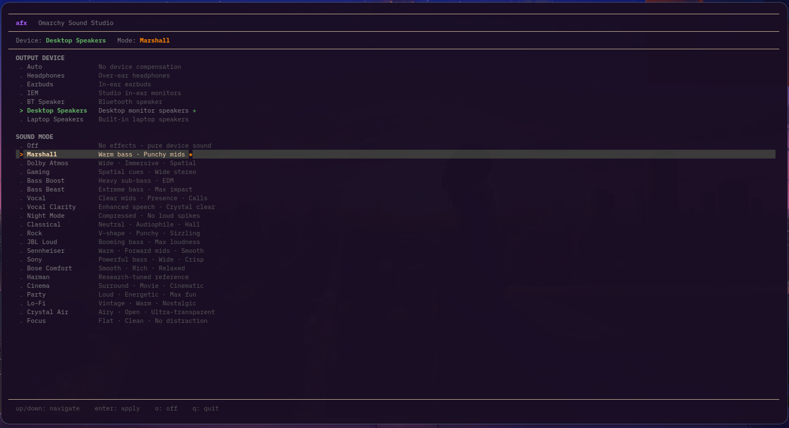

<div align="center">

# omarchy-audio-fx

**21 audio presets for Linux — Marshall, Dolby Atmos, Harman, Sony and more**

[](LICENSE)
[](https://github.com/wwmm/easyeffects)
[](https://pipewire.org)
[](https://omarchy.dev)

</div>




---

I was using [Omarchy](https://omarchy.dev) on Linux and got annoyed that I had to either deal with flat boring audio or manually open EasyEffects every time I wanted to change how music sounds. So I built this — a collection of audio presets you can switch with a single keypress.

The thing that makes this a bit different: **you never have to tell it what device you're using.** You just pick the sound you want — Marshall, Dolby, Harman, whatever — and it figures out what's plugged in, then adjusts the preset for that device automatically. Plug in headphones and it adds crossfeed. Switch to earbuds and it adds bass virtualization. Laptop speakers get widened stereo. You don't have to think about it.

---

## How it works

Pick a **sound signature** (the character you want) or an **experience mode** (what you're doing). The system reads your active audio device from PipeWire, picks the right correction for it, and merges both together before loading the preset.

```
You pick:   Marshall
System sees: Stone 1500 Bluetooth → earbuds
Auto-applies: bass virtualization + Marshall EQ + compressor
Result:      Marshall sound, tuned for earbuds, one keypress
```

No device selection menus. No manual profiles. Just press `Super+M` and pick your sound.

---

## Sound signatures

These change the character of your audio. Device tuning is always applied on top automatically.

| Preset | What it sounds like |
|--------|-------------------|
| Marshall | Warm, bassy, punchy mids — like a guitar amp |
| Dolby-Atmos | Wide, spacious, cinematic |
| Harman | Balanced and natural — backed by actual research from Harman International |
| Sony-Clear | Deep bass + clear vocals, inspired by WH-1000XM |
| Bose-Comfort | Smooth and easy on the ears for long sessions |
| JBL-Loud | Boosted bass and highs, great for parties |
| Sennheiser-Detail | Flat and accurate, for when you want to hear everything |
| Bass-Beast | Pure bass — psychoacoustic sub on top of everything |
| Vocal-Clarity | Makes voices and podcasts sound crisp and clear |
| Lo-Fi | Warm, vintage, rolled-off highs — cozy vibes |
| Crystal-Air | Airy and detailed, works really well with IEMs |
| Night-Mode | Quieter, compressed — good for late night listening |

---

## Experience modes

For when you care more about what you're doing than how it sounds.

| Preset | When to use |
|--------|------------|
| Cinema | Watching movies — wider stage, boosted dialogue |
| Gaming | Boosts the frequencies where footsteps and spatial detail live |
| Party | Maximum bass, loud, with a hard limiter to protect your speakers |
| Focus | Flat and fatigue-free — good for long work or study sessions |

---

## What happens per device

The system detects your device and silently adds the right layer:

| Device | Auto-applied |
|--------|-------------|
| Headphones (wired) | Crossfeed — removes the in-head feeling that wired headphones have |
| Earbuds / Bluetooth earbuds | Bass virtualization — makes tiny drivers sound much bigger |
| Bluetooth speaker | SBC codec compensation — restores highs + warms up bass |
| Laptop speakers | Bass virtualization + stereo widening |
| Desktop speakers | Reference — no correction, just the signature |

You can check what it detected at any time:

```bash
audiofx device
```

---

## Runs in the background — closes with nothing

The installer sets up EasyEffects as a **systemd user service**. This means:

- It starts automatically when you log in
- It keeps running even after you close the terminal
- Music plays through your effects all day without you doing anything
- To actually stop it: `audiofx off` (bypass) or `systemctl --user stop easyeffects`

You never need to keep a terminal open for your audio mode to work. Press `Super+M`, close the terminal, music still sounds like Marshall.

---

## Install

```bash
git clone https://github.com/pr4xh4r/omarchy-audio-fx
cd omarchy-audio-fx
chmod +x install.sh && ./install.sh
```

**You need:** EasyEffects 8.x, PipeWire, Python 3

---

## Super+M keybinding

On Omarchy, press `Super+M` to cycle through every preset. You'll get a desktop notification with the preset name and what device was detected.

```
Off → Marshall → Dolby Atmos → Harman → Sony Clear → Bose Comfort
    → JBL Loud → Sennheiser Detail → Bass Beast → Vocal Clarity
    → Lo-Fi → Crystal Air → Night Mode → Cinema → Gaming → Party → Focus → Off
```

If you're not on Omarchy but still use Hyprland:

```
bind = SUPER, M, exec, audio-mode
```

---

## CLI usage

```bash
audiofx list              # see all signatures and modes
audiofx status            # what's active + what device was detected
audiofx device            # show device name, type, and what's being applied
audiofx set Marshall      # apply Marshall (device auto-tuned)
audiofx set Dolby-Atmos   # apply Dolby Atmos (device auto-tuned)
audiofx mode Cinema       # apply Cinema mode (device auto-tuned)
audiofx mode Gaming       # apply Gaming mode
audiofx off               # turn off all effects
```

**If the auto-detection gets your device wrong**, you can override it:

```bash
audiofx device set headphones       # force headphone tuning (crossfeed)
audiofx device set earbuds          # force earbud tuning (bass virtualization)
audiofx device set iem              # force IEM tuning (resonance fix)
audiofx device set laptop-speakers  # force laptop speaker tuning
audiofx device set desktop-speakers # force desktop speaker / BT speaker tuning
audiofx device reset                # go back to auto-detection
```

The override is saved persistently — it stays until you reset it, even after reboots.

Shortcut — just type the preset name directly:

```bash
audiofx Marshall
audiofx Dolby-Atmos
```


---

## Without the CLI

Open EasyEffects, go to Presets, and load any preset from the list. Everything installed by this project shows up there. The smart merging only happens when you use the CLI or the `Super+M` shortcut — if you load presets manually through EasyEffects, it'll just load the signature without device tuning, which is fine too.

---

## How some of the features actually work

**Crossfeed (headphones)**
When you listen on headphones, your left ear only hears left and right ear only hears right. On real speakers, both ears hear both sides — your brain is built for that. Crossfeed simulates it. The result is that headphone listening feels way more natural and less tiring after an hour or two.

**Bass virtualization (earbuds)**
A 6mm earbud driver can't actually produce 40Hz bass — it's too small. But there's a trick: if you play the 2nd and 3rd harmonics of a bass note (80Hz and 120Hz), the brain fills in the missing 40Hz by itself. This preset exploits that to make earbuds sound much bassier than their hardware would normally allow.

**Harman curve**
Harman (who owns JBL and AKG) ran a large study testing what EQ curve most people actually prefer when they don't know what they're listening to. The result was a specific curve with a gentle bass lift and controlled highs. The Harman preset implements that curve. It's the closest thing to a scientifically correct "sounds good to most people" EQ.

---

## Contributing

Open a PR with a `.json` EasyEffects file in the right folder and a short description of what it sounds like and what device it's for. No formal template needed.

---

## License

MIT — do whatever you want with it.

> Marshall, Dolby, Harman, Sony, Bose, JBL, and Sennheiser are trademarks of their respective companies. This project has no affiliation with any of them — the presets just try to capture a similar sound using open-source tools.
